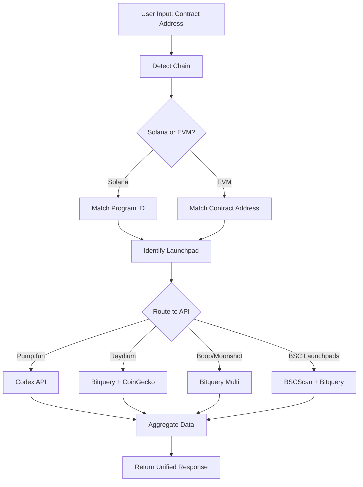

# Future Updates - Launchpad Integration Framework

## Overview
Complete framework for integrating multiple launchpad platforms into the scanner to automatically detect and analyze tokens from various launchpads across Solana and EVM chains.

---

## Part 1: Launchpad Registry

### Solana Launchpads

| Launchpad | Program ID | Specialty |
|-----------|-----------|-----------|
| **Pump.fun** | `6EF8rrecthR5Dkzon8Nwu78hRvfCKubJ14M5uBEwF6P` | Largest Solana memecoin launchpad, bonding curve model |
| **Raydium LaunchLab** | `LanMV9sAd7wArD4vJFi2qDdfnVhFxYSUg6eADduJ3uj` | Official Raydium launchpad, migrates to CPMM pools |
| **Moonshot (DexScreener)** | `MoonCVVNZFSYkqNXP6bxHLPL6QQJiMagDL3qcqUQTrG` | DexScreener's launchpad platform |
| **LetsBonk.fun** | Uses Raydium LaunchLab | BONK community-driven launchpad |
| **Meteora DBC** | Separate Program ID | Meteora's Dynamic Bonding Curve |

### EVM Chain Launchpads

| Launchpad | Chain | Contract Address |
|-----------|-------|-----------------|
| **Flap.sh** | BSC | `0x1de460f363AF910f51726DEf188F9004276Bf4bc` |
| **Four.meme** | BSC | `0x5c952063c7fc8610FFDB798152D69F0B9550762b` |
| **PinkSale** | BSC | `0x602bA546A7B06e0FC7f58fD27EB6996eCC824689` |
| **Polkastarter** | Ethereum | `0x83e6f1E41cdd28eacEB20Cb649155049Fac3D5Aa` |

---

## Part 2: Data Collection APIs

### A. Pump.fun Data APIs

| API Provider | What It Provides | Pricing |
|-------------|------------------|---------|
| **Codex API** | New launches, real-time price, trading activity, holder data, graduation tracking (0-100%) | Free tier: 10,000 requests/month |
| **Bitquery Pump.fun API** | Token creation, bonding-curve trades, graduation, creator holdings | From $49/month |
| **Moralis Solana API** | Pump.fun token data | Free tier + Paid |
| **PumpPortal WebSocket** | Real-time token creation, migration, trading | Free (no key required) |
| **SolanaTracker API** | 70+ REST endpoints | Free + Paid |

### B. Raydium LaunchLab Data APIs

| API Provider | What It Provides | Pricing |
|-------------|------------------|---------|
| **Bitquery Raydium Launchpad API** | Pool creation, migrate_to_amm/migrate_to_cpswap tracking, market cap, FDV | From $49/month |
| **CoinGecko Raydium Launchlab API** | Real-time price, OHLCV (1 second interval), trades, metadata (logo, social links), bonding curve data, security data | Free + Paid |
| **Raydium SDK V2** | `raydium.launchpad.getLaunchById()` for launch state | Open source (Free) |

### C. Multi-Launchpad Data APIs

| API Provider | What It Provides | Pricing |
|-------------|------------------|---------|
| **Bitquery Multi-Launchpad Subscription** | Boop.fun, Raydium Launchlab, Meteora DBC, Moonshot, LetsBonk.fun token migration | From $49/month |
| **Codex API** | Filter tokens from any launchpad using `filterTokens` query | Free 10,000/month |

---

## Part 3: Implementation Architecture

### Step 1: Contract Address Input

**Process:**
1. User provides contract address
2. Detect chain (Solana/EVM)
3. Match Program ID or Contract Address to identify source launchpad

### Step 2: Launchpad Detection Logic

```javascript
// Solana Launchpad Detection
const LAUNCHPAD_PROGRAMS = {
  '6EF8rrecthR5Dkzon8Nwu78hRvfCKubJ14M5uBEwF6P': 'Pump.fun',
  'LanMV9sAd7wArD4vJFi2qDdfnVhFxYSUg6eADduJ3uj': 'Raydium LaunchLab',
  'MoonCVVNZFSYkqNXP6bxHLPL6QQJiMagDL3qcqUQTrG': 'Moonshot',
  'boop8hVGQGqehUK2iVEMEnMrL5RbjywRzHKBmBE7ry4': 'Boop.fun'
};

// EVM Launchpad Detection
const EVM_LAUNCHPAD_CONTRACTS = {
  '0x1de460f363AF910f51726DEf188F9004276Bf4bc': 'Flap.sh (BSC)',
  '0x5c952063c7fc8610FFDB798152D69F0B9550762b': 'Four.meme (BSC)',
  '0x602bA546A7B06e0FC7f58fD27EB6996eCC824689': 'PinkSale (BSC)',
  '0x83e6f1E41cdd28eacEB20Cb649155049Fac3D5Aa': 'Polkastarter (Ethereum)'
};

function detectLaunchpad(address, chain) {
  if (chain === 'solana') {
    return LAUNCHPAD_PROGRAMS[address] || 'Unknown';
  } else {
    return EVM_LAUNCHPAD_CONTRACTS[address.toLowerCase()] || 'Unknown';
  }
}
```

### Step 3: API Routing by Launchpad

#### For Pump.fun Tokens

```javascript
// Using Codex API
const { filterTokens } = await sdk.query(gql`
  query {
    filterTokens(
      filters: { 
        network: [1399811149] 
        launchpadName: ["Pump.fun"] 
        tokenAddress: ["<USER_INPUT_ADDRESS>"]
      }
    ) {
      results {
        token { 
          address 
          name 
          symbol 
          info { imageThumbUrl } 
        }
        priceUSD 
        liquidity 
        marketCap 
        volume24
        launchpad { 
          graduationPercent 
          migrated 
          migratedAt 
          migratedPoolAddress 
        }
        createdAt
      }
    }
  }
`);
```

#### For Raydium LaunchLab Tokens

```javascript
// Using Bitquery GraphQL
{
  Solana {
    Instructions(
      where: { 
        program: { 
          address: { is: "LanMV9sAd7wArD4vJFi2qDdfnVhFxYSUg6eADduJ3uj" } 
        }
        transaction: { 
          accountIncludes: "<TOKEN_ADDRESS>" 
        }
      }
    ) {
      Block { Time }
      Instruction { 
        Args
        Accounts { address }
      }
    }
  }
}
```

### Step 4: Data Processing & Output

| Data Type | Source | Output Format |
|-----------|--------|---------------|
| **Basic Metadata** | Codex / CoinGecko | Name, symbol, logo, social links |
| **Bonding Curve Progress** | Codex (graduationPercent) | 0-100% score |
| **Graduation Status** | Codex / Bitquery | migrated: true/false, migratedPoolAddress |
| **Price & Volume** | CoinGecko / Bitquery | USD price, 24h volume, market cap |
| **Trade Activity** | Bitquery (Trading.Trades) | Buy/Sell list, timestamp, USD value |
| **Holder Data** | Codex | Top holders, holder count |
| **Security Check** | CoinGecko (GT Scores) | Honeypot detection, mint/freeze authority |

---

## Implementation Guidelines

### 1. User Input
- Accept contract address from user
- Validate address format based on chain

### 2. Chain & Launchpad Detection
- Match Program ID (Solana) or Contract Address (EVM)
- Identify source launchpad

### 3. API Routing
Route to correct API based on launchpad:
- **Pump.fun** → Codex API / Bitquery Pump.fun API
- **Raydium LaunchLab** → Bitquery Raydium API / CoinGecko
- **Boop.fun / Moonshot** → Bitquery Multi-Launchpad API

### 4. Data Aggregation
- Collect data from all sources
- Create unified response object
- Handle API rate limits and errors

### 5. Output Format
Unified token analysis object:
```typescript
interface LaunchpadTokenAnalysis {
  // Basic Info
  address: string;
  name: string;
  symbol: string;
  logo: string;
  chain: 'solana' | 'ethereum' | 'bsc';
  launchpad: string;
  
  // Launchpad Specific
  bondingCurve: {
    progress: number; // 0-100
    graduated: boolean;
    migratedPoolAddress?: string;
    migratedAt?: string;
  };
  
  // Market Data
  price: {
    usd: number;
    change24h: number;
  };
  volume24h: number;
  marketCap: number;
  liquidity: number;
  
  // Activity
  trades: Array<{
    type: 'buy' | 'sell';
    amount: number;
    priceUsd: number;
    timestamp: string;
    txHash: string;
  }>;
  
  // Holders
  holders: {
    total: number;
    top10: Array<{
      address: string;
      balance: number;
      percentage: number;
    }>;
  };
  
  // Security
  security: {
    honeypot: boolean;
    mintAuthority: boolean;
    freezeAuthority: boolean;
    score: number; // 0-100
  };
  
  // Metadata
  social: {
    website?: string;
    twitter?: string;
    telegram?: string;
    discord?: string;
  };
  createdAt: string;
}
```

---

## API Integration Priorities

### Phase 1: Core Launchpads (High Priority)
1. **Pump.fun** - Most popular Solana memecoin launchpad
2. **Raydium LaunchLab** - Official Raydium launchpad
3. **Flap.sh (BSC)** - Popular BSC launchpad

**Recommended APIs:**
- Codex API (free tier 10k requests/month)
- CoinGecko (free + paid tiers)
- Bitquery (paid from $49/month)

### Phase 2: Extended Coverage (Medium Priority)
1. Moonshot (DexScreener)
2. Boop.fun
3. Four.meme (BSC)
4. PinkSale (BSC)

**Recommended APIs:**
- Bitquery Multi-Launchpad Subscription
- Moralis Solana API

### Phase 3: Enterprise Features (Low Priority)
1. Meteora DBC
2. LetsBonk.fun
3. Polkastarter (Ethereum)

---

## Technical Requirements

### Environment Variables Needed

```bash
# Codex API
CODEX_API_KEY=your_codex_api_key

# Bitquery
BITQUERY_API_KEY=your_bitquery_api_key
BITQUERY_OAUTH_TOKEN=your_oauth_token

# CoinGecko
COINGECKO_API_KEY=your_coingecko_api_key

# Moralis
MORALIS_API_KEY=your_moralis_api_key

# PumpPortal WebSocket
PUMPPORTAL_WS_URL=wss://pumpportal.fun/api/data

# Raydium SDK
RAYDIUM_RPC_URL=your_solana_rpc_url
```

### New Files to Create

```
lib/launchpad/
├── registry.ts              # Launchpad program IDs and contracts
├── detector.ts              # Chain and launchpad detection logic
├── api/
│   ├── codex.ts            # Codex API integration
│   ├── bitquery.ts         # Bitquery GraphQL integration
│   ├── coingecko.ts        # CoinGecko API integration
│   ├── moralis.ts          # Moralis API integration
│   ├── pumpportal.ts       # PumpPortal WebSocket integration
│   └── raydium-sdk.ts      # Raydium SDK integration
├── aggregator.ts            # Data aggregation logic
├── types.ts                 # TypeScript interfaces
└── utils.ts                 # Helper functions

app/api/launchpad/
├── detect/route.ts          # POST endpoint to detect launchpad
├── analyze/route.ts         # POST endpoint to analyze token
└── [launchpad]/route.ts     # GET endpoint per launchpad
```

---

## API Call Flow



---

## Security Considerations

1. **API Key Protection**
   - Store all API keys in environment variables
   - Never expose keys in frontend code
   - Use server-side API routes only

2. **Rate Limiting**
   - Implement request caching (60s for price data)
   - Use Redis for distributed caching
   - Respect API provider rate limits

3. **Error Handling**
   - Graceful fallbacks when APIs are unavailable
   - Display partial data if some sources fail
   - Log errors for monitoring

4. **Data Validation**
   - Validate contract addresses before API calls
   - Sanitize user inputs
   - Verify data integrity from APIs

---

## Cost Estimation

### Free Tier Usage (Suitable for MVP)
- Codex API: 10,000 requests/month
- CoinGecko: 30 calls/minute
- PumpPortal: Unlimited (WebSocket)
- Raydium SDK: Free (open source)

**Estimated Monthly Capacity:** ~300-500 scans/day

### Paid Tier (Production Ready)
- Codex API Pro: ~$50/month (100k requests)
- Bitquery Developer: $49/month
- CoinGecko Analyst: $129/month
- Moralis Scale: $49/month

**Total:** ~$277/month
**Estimated Capacity:** ~5,000-10,000 scans/day

---

## Testing Strategy

### 1. Test Contract Addresses

**Pump.fun:**
```
Example: pump123...abc (replace with actual address)
Expected: Detect Pump.fun, show bonding curve progress
```

**Raydium LaunchLab:**
```
Example: rayd456...def (replace with actual address)
Expected: Detect Raydium, show migration status
```

### 2. API Integration Tests
- Test each API provider separately
- Verify response format matches expectations
- Test error handling (invalid addresses, API failures)

### 3. End-to-End Tests
- Test full flow: input → detection → API calls → aggregation → output
- Test with multiple launchpads
- Test with edge cases (graduated tokens, failed migrations)

---

## Monitoring & Analytics

### Metrics to Track
1. API response times per provider
2. Success/failure rates per API
3. Cache hit rates
4. Most scanned launchpads
5. User engagement with launchpad data

### Logging
- Log all API calls with timestamps
- Log detected launchpads
- Log errors with context
- Track API quota usage

---

## Future Enhancements

### Phase 4: Advanced Features
1. **Real-time Monitoring**
   - WebSocket connections to track live launches
   - Push notifications for new tokens
   - Price alerts for graduated tokens

2. **Historical Analysis**
   - Track token performance post-launch
   - Success rate analysis per launchpad
   - Trend analysis

3. **Predictive Analytics**
   - ML models to predict graduation likelihood
   - Risk scoring for new launches
   - Rug pull detection

4. **Portfolio Tracking**
   - Track user's launchpad investments
   - ROI calculation
   - Performance comparison

---

## References

### Documentation Links
- [Codex API Docs](https://docs.codex.io/)
- [Bitquery Pump.fun Docs](https://docs.bitquery.io/docs/examples/Solana/Pump-Fun-API/)
- [CoinGecko Raydium Docs](https://www.coingecko.com/en/api/documentation)
- [Raydium SDK V2](https://github.com/raydium-io/raydium-sdk-V2)
- [PumpPortal API](https://pumpportal.fun/documentation)

### Community Resources
- Pump.fun Telegram: https://t.me/pumpfun
- Raydium Discord: https://discord.gg/raydium
- Solana Developer Discord: https://discord.gg/solana

---

## Implementation Checklist

- [ ] Set up Codex API integration
- [ ] Set up Bitquery GraphQL client
- [ ] Set up CoinGecko API integration
- [ ] Create launchpad registry
- [ ] Implement detection logic
- [ ] Create API routing system
- [ ] Build data aggregator
- [ ] Create TypeScript types
- [ ] Build API endpoints
- [ ] Implement caching layer
- [ ] Add error handling
- [ ] Write unit tests
- [ ] Write integration tests
- [ ] Add monitoring/logging
- [ ] Update documentation
- [ ] Deploy to production

---

## Token Sniffer Analysis Features (Reference for Comparison)

### Overview
Features observed from Token Sniffer results page that should be compared with current project implementation to identify gaps and opportunities for enhancement.

### 1. Audit Score Display
**Feature:** Overall security score (0-100)
- Visual score display with color coding
- Clear disclaimer about automated scanner limitations
- Warning that high scores can still have hidden malicious code
- Recommendation to consult multiple sources
- Results regeneration frequency (15 minutes)

**Components:**
```
- Score header with X/100 format
- Disclaimer text about limitations
- Timestamp of last scan/regeneration
```

### 2. Swap Analysis Section
**Feature:** Honeypot detection via integrated service
- **Provider:** honeypot.is
- **Check:** "Token is sellable (not a honeypot) at this time"
- Status indicator (✓ for pass)

**Key Points:**
- Third-party integration for swap testing
- Real-time sellability verification
- Clear pass/fail indicators

### 3. Contract Analysis Section
**Features checked:**

#### a) Verified Contract Source
- ✓ Contract source code is verified on blockchain explorer
- Important for transparency and auditing

#### b) Ownership Status
- ✓ "Ownership renounced or source does not contain an owner contract"
- Critical for preventing rug pulls
- Checks if owner privileges have been removed

#### c) Special Permissions Check
- ✓ "Creator not authorized for special permission"
- Verifies creator cannot execute privileged functions
- Prevents hidden backdoors

**Display Format:**
```
Contract Analysis
  ✓ Verified contract source
  ✓ Ownership renounced or source does not contain an owner contract
  ✓ Creator not authorized for special permission
```

### 4. Holder Analysis Section
**Features with "View Holders" link:**

#### a) Creator Wallet Holdings
- ✓ "Creator wallet contains less than 5% of circulating token supply (0%)"
- Shows exact percentage
- Critical threshold: 5%
- Prevents creator dump risk

#### b) Other Holders Distribution
- ✓ "All other holders possess less than 5% of circulating token supply"
- Ensures no whale concentration
- Reduces manipulation risk

#### c) Top 10 Holders Concentration
- ✓ "Top 10 token holders possess less than 70% of circulating token supply (6.33%)"
- Shows exact percentage
- Critical threshold: 70%
- Example shows healthy distribution at 6.33%

**Display Format:**
```
Holder Analysis    [View Holders]
  ✓ Creator wallet contains less than 5% of circulating token supply (0%)
  ✓ All other holders possess less than 5% of circulating token supply
  ✓ Top 10 token holders possess less than 70% of circulating token supply (6.33%)
```

### 5. Liquidity Analysis Section
**Features with DEX/Locker integration:**

#### a) Current Liquidity Check
- ✗ "Adequate current liquidity"
- Shows liquidity amount and DEX
- Example: "< 0.01 BNB in PancakeSwap v3 1%"
- Links to liquidity pool view
- Failure indicator when insufficient
- Warning message: "Not enough liquidity is present which could potentially cause high slippage and other problems when swapping"

#### b) Liquidity Lock Status
- ✗ "At least 95% of largest pool's liquidity burned/locked for 15 days or longer (0%)"
- Shows exact lock percentage
- Time threshold: 15 days minimum
- Critical for preventing liquidity rug pulls

**Display Format:**
```
Liquidity Analysis
  Please see the list of supported DEXes and lockers.
  
  ✗ Adequate current liquidity
    < 0.01 BNB in PancakeSwap v3 1%  [View LP]
    Warning: Not enough liquidity is present which could potentially cause 
    high slippage and other problems when swapping.
  
  ✗ At least 95% of largest pool's liquidity burned/locked for 15 days or longer (0%)
```

### 6. Integration Points Noted

#### External Services:
1. **honeypot.is** - Swap/sellability testing
2. **DEX Integration** - Liquidity data (PancakeSwap v3, Uniswap, etc.)
3. **Liquidity Lockers** - Lock verification (Team Finance, Unicrypt, PinkLock, etc.)
4. **Blockchain Explorers** - Contract verification status

### 7. Key Thresholds & Criteria

| Metric | Threshold | Status |
|--------|-----------|--------|
| Creator Holdings | < 5% | CRITICAL |
| Individual Holder | < 5% | IMPORTANT |
| Top 10 Holders | < 70% | IMPORTANT |
| Liquidity Lock | ≥ 95% for 15+ days | CRITICAL |
| Minimum Liquidity | Chain-specific minimum | IMPORTANT |
| Contract Verification | Must be verified | IMPORTANT |
| Ownership | Should be renounced | CRITICAL |
| Special Permissions | Should be disabled | CRITICAL |

### 8. UI/UX Patterns Observed

#### Visual Indicators:
- ✓ Green checkmark for passed tests
- ✗ Red X for failed tests
- Color coding for severity

#### Information Architecture:
```
Score (prominent at top)
↓
Disclaimer (immediately after score)
↓
Swap Analysis (first security check)
↓
Contract Analysis (code-level checks)
↓
Holder Analysis (distribution checks)
↓
Liquidity Analysis (market depth checks)
```

#### Interactive Elements:
- "View Holders" link for detailed holder breakdown
- "View LP" link to see liquidity pool details
- External links to honeypot.is, DEX interfaces
- Link to supported DEXes and lockers list

### 9. Warning & Error Messages

#### Examples Observed:
1. **Score Disclaimer:**
   ```
   "A token with a high score may still have hidden malicious code. 
   The score is not advice and should be considered along with other factors. 
   Always do your own research and consult multiple sources of information."
   ```

2. **Liquidity Warning:**
   ```
   "Not enough liquidity is present which could potentially cause high 
   slippage and other problems when swapping."
   ```

3. **Result Freshness:**
   ```
   "Results are regenerated every 15 minutes"
   ```

### 10. Comparison Checklist (For Future Review)

**To be compared with current project:**

- [ ] Do we have an overall audit score (0-100)?
- [ ] Do we check honeypot status via external service?
- [ ] Do we verify contract source code verification?
- [ ] Do we check ownership renouncement?
- [ ] Do we check special permissions/backdoors?
- [ ] Do we analyze creator wallet holdings?
- [ ] Do we check individual holder concentrations?
- [ ] Do we analyze top 10 holder distribution?
- [ ] Do we verify adequate liquidity levels?
- [ ] Do we check liquidity lock status and duration?
- [ ] Do we integrate with DEX APIs for liquidity data?
- [ ] Do we integrate with liquidity locker services?
- [ ] Do we provide "View Holders" detailed breakdown?
- [ ] Do we show exact percentages for holdings?
- [ ] Do we have clear pass/fail visual indicators?
- [ ] Do we display warnings for failed checks?
- [ ] Do we have appropriate disclaimers?
- [ ] Do we show scan timestamp/freshness?
- [ ] Do we link to external explorers/DEXes?
- [ ] Do we support multiple chains (BSC, ETH, Solana)?

### 11. Enhancement Opportunities

Based on Token Sniffer analysis, potential improvements:

1. **Score Aggregation System**
   - Combine multiple check results into single 0-100 score
   - Weight different checks by importance
   - Visual score display with color coding

2. **Enhanced Holder Analysis**
   - Real-time holder distribution data
   - Top N holders detailed breakdown
   - Whale alert thresholds
   - Historical holder trend tracking

3. **Liquidity Monitoring**
   - Multi-DEX liquidity aggregation
   - Liquidity locker integration (Team Finance, Unicrypt, PinkLock)
   - Minimum liquidity thresholds per chain
   - LP token tracking and burn verification

4. **Contract Security Deep Dive**
   - Ownership status verification
   - Special permissions audit
   - Backdoor detection
   - Proxy contract analysis

5. **Third-Party Integrations**
   - honeypot.is API integration
   - DEX API integrations (PancakeSwap, Uniswap, Raydium)
   - Liquidity locker APIs
   - Block explorer APIs for verification status

6. **User Experience**
   - Clear pass/fail indicators with icons
   - Contextual warnings for failed checks
   - Detailed explanations for each metric
   - "View Details" links for deep dives
   - Timestamp showing data freshness

---

## Token Deployer Information Enhancement

### Current Status
**Deployer Address:** Currently shown in Deep Scan results only

### Required Enhancement
Add token deployer information to ALL scan types:

#### Information to Display:
1. **Token Deployer Address**
   - Full address with copy button
   - Link to block explorer
   - ENS name resolution (if available)

2. **Token Deploy Date**
   - Exact timestamp (date + time)
   - Relative time (e.g., "2 days ago")
   - Age in days/hours for quick reference

#### Implementation Locations:

**1. Basic Scan Results**
- Add "Deployment Info" section or card
- Display deployer address and deploy date
- Position: After token overview, before security checks

**2. Elevator Scan Results**
- Add to token metadata section
- Display alongside other token details
- Position: In the main token information card

**3. Deep Scan Results**
- Already has deployer address
- Add deploy date/timestamp
- Enhance existing deployment info display

#### Data Sources:

**For Solana Tokens:**
```typescript
// Get token creation transaction
const signatures = await connection.getSignaturesForAddress(
  tokenAddress,
  { limit: 1000 },
  'confirmed'
);
// Find mint transaction (oldest signature)
const mintTx = signatures[signatures.length - 1];
const deployDate = new Date(mintTx.blockTime * 1000);
const deployerAddress = mintTx.transaction.message.accountKeys[0];
```

**For EVM Tokens:**
```typescript
// Get contract creation transaction
const contract = await ethers.getContractAt('ERC20', tokenAddress);
const deployTx = await provider.getTransaction(contract.deployTransaction.hash);
const deployDate = new Date(block.timestamp * 1000);
const deployerAddress = deployTx.from;
```

#### Display Format Example:

```
┌─ Deployment Information ─────────────────────────┐
│                                                   │
│ Deployer: 0x1234...5678  [Copy] [View Explorer]  │
│ Deployed: Jan 15, 2026 14:32:18 UTC              │
│ Age: 2 days ago                                   │
│                                                   │
└───────────────────────────────────────────────────┘
```

#### Priority: HIGH
**Reason:** Essential information for security analysis and trust assessment

#### Implementation Checklist:
- [ ] Add deployer address extraction to Basic Scan service
- [ ] Add deploy date/timestamp extraction to Basic Scan service
- [ ] Add deployer address extraction to Elevator Scan service
- [ ] Add deploy date/timestamp extraction to Elevator Scan service
- [ ] Add deploy date to Deep Scan (already has address)
- [ ] Update TypeScript types for all scan result interfaces
- [ ] Create reusable DeploymentInfo component
- [ ] Add copy-to-clipboard functionality
- [ ] Add block explorer links (chain-specific)
- [ ] Add relative time formatting ("2 days ago")
- [ ] Add ENS name resolution for Ethereum deployers
- [ ] Update API response types
- [ ] Test with Solana tokens
- [ ] Test with EVM tokens (BSC, Ethereum)
- [ ] Update documentation

---

**Document Version:** 1.2  
**Last Updated:** 2026-08-03  
**Status:** Planning Phase  
**Priority:** Medium-High (Post-Boost Feature Launch)

**New Sections Added:**
- Token Sniffer Analysis Features (Reference)
- Token Deployer Information Enhancement (HIGH PRIORITY)

**Purpose:** Benchmark comparison for security analysis features and track required enhancements
