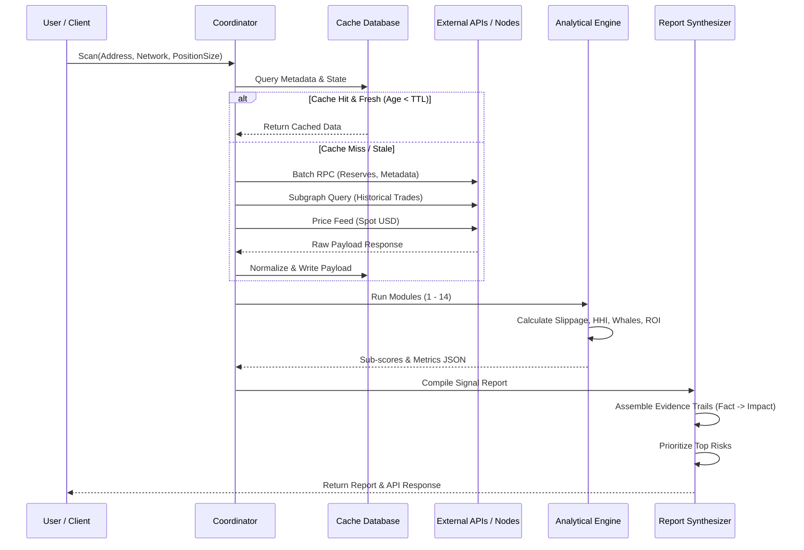

# Data Flow Pipelines

## Overview
This document trace the path of data from the initial contract address entry to the final trader-facing intelligence report.

---

## 1. Sequence Diagram: Data Pipeline Flow

---

## 2. Data Transformation Stages

### Stage 1: Validation & Ingestion
* Input validation checks contract format.
* Metadata fetch identifies target decimal values.

### Stage 2: Normalization & Storage
* Numeric values converted to strings.
* Gas metrics standardized to USD equivalent.
* Events indexed by block height.

### Stage 3: Feature Ingestion
* Module runners slice data into specific windows (5m, 1h, 24h, 7d).
* Computes mathematical matrices (constant product derivatives, wallet graphs).

### Stage 4: Evidentiary Mapping
* Metrics are checked against threshold configurations.
* Triggers populate the `evidence` schema list.
* Final Markdown and JSON are rendered.
