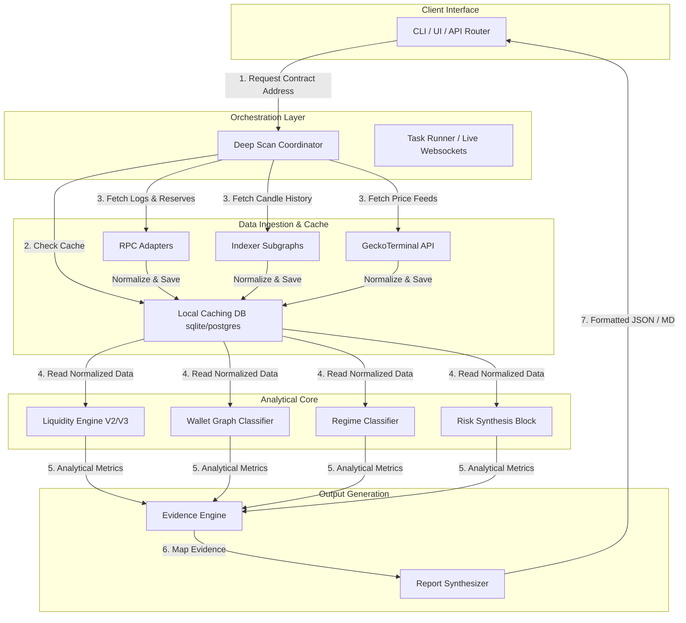

# System Architecture

## Overview
The Deep Scan intelligence engine is divided into distinct layers to isolate raw data fetching, caching, analysis, and report generation. This decoupled design ensures stability, high performance, and minimal RPC load.

---

## 1. Component Block Diagram

---

## 2. Core Subsystems

### 2.1 Ingestion & Adapter Layer
Handles JSON-RPC multi-calls, HTTP REST requests, and graph queries. Translates provider-specific responses into standardized local structures. Implements client-side rate limiters and automatic retry strategies.

### 2.2 Cache & Persistence Layer
A local lightweight database storing block logs, address profiling records, and transaction listings. Enables complex graph searches (like tracing co-funding parent addresses) without hitting remote blockchain nodes repeatedly.

### 2.3 Analysis Core (Modules 1-14)
Independent, functional execution blocks that ingest data arrays and compute scores, trends, and execution slippage. Modules have zero side effects and are tested individually against fixed datasets.

### 2.4 Evidence & Synthesis Layer (Module 15)
Inspects outputs from all analysis cores. Builds the `evidence` pointers and synthesizes the finalized markdown report, resolving conflicting indicators before passing results to the outer interface.
