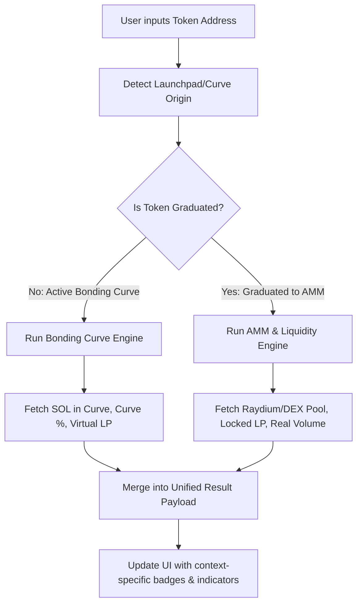

# Dual Scanning Mode Upgrades: Bonding Curve & Launchpad Enhancements

This document outlines the architectural enhancements to be integrated directly into the existing **Basic Scan** and **Deep Scan** systems rather than launching a standalone scanner. The objective is to enrich our scan results for newly created tokens launched via bonding curves and structured launch platforms (like Raydium LaunchLab and Pump.fun).

---

## 1. Rationale: Why Integrate Raydium LaunchLab & Bonding Curves?

* **Enhanced Threat Intelligence**: Modern memecoin launches utilize bonding curves (Pump.fun) or concentrated liquidity launchpads (Raydium LaunchLab) before migrating to standard AMMs. These systems have unique rules, locking periods, and developer behaviors.
* **Unified Interface**: Users do not want to navigate to a third scanning page. Strengthening the existing `deep_scan` and `basic_scan` logic keeps the user experience clean and frictionless.
* **Proactive Risk Flagging**: By analyzing the curve progress, creator actions on launch, and lock states directly in the main scans, the scanner provides immediate, context-aware warnings.

---

## 1.5 Current Codebase Integration Points
Based on the [Codebase Gap Analysis](file:///d:/scanner/futures_update_space/current_state_gap_analysis.md), the core upgrades will target:
* **Route Logic**: Inserting launchpad detection directly in `detectNetwork` in [`tokenScanner.ts`](file:///d:/scanner/lib/blockchain/tokenScanner.ts).
* **Solana Scanner**: Updating [`solanaScanner.ts`](file:///d:/scanner/lib/blockchain/solanaScanner.ts) to check if the token is pre-graduation to override the standard `fetchMarketDataWithFallback` call, preventing false-positive 0-liquidity reports.
* **Risk Engine**: Customizing the multi-analyzer flow in [`DeepScanService.ts`](file:///d:/scanner/lib/deep_scan/DeepScanService.ts) for young tokens.

---

## 2. Dual-Path Routing: Pre-Graduation vs. Post-Graduation

To prevent erroneous reports (e.g. reporting "Zero Liquidity" or "Failed Liquidity Check" for active curves), the scanner must split analysis into two distinct execution paths:

### Path A: Active Bonding Curve Engine (Pre-Graduation)
* **API Routing**: Skips standard DEX pool queries (Raydium/Uniswap) which would return empty results or errors. Queries `Codex API` or `PumpPortal` for virtual reserves.
* **Liquidity Metric**: Replaces "Liquidity Pool Value" with "SOL Deposited in Bonding Curve" (e.g. X / 85 SOL).
* **Buy/Sell Verification**: Verifies trades against the bonding curve program instructions rather than standard swap instructions.
* **Risk Flags**: Flags curves that have stalled (e.g. <5% progress over 24h) or creator sell-offs on the curve.

### Path B: Standard DEX Engine (Post-Graduation)
* **API Routing**: Standard routing to DEX screener, Raydium SDK, and block explorers.
* **Liquidity Metric**: Standard LP valuation and burn/lock verification (e.g. PinkLock, Raydium LP burn status).
* **Launchpad Legacy Tracking**: Adds a "Graduated from Pump.fun" history trace badge with the graduation timestamp and initial launch data.

### A. Basic Scan Upgrades (Cost: 2 credits)
* **Launch Origin Badge**: Display a warning badge (e.g., `Pump.fun`, `Raydium LaunchLab`) if a token is identified as coming from a launchpad.
* **Token Age Badge**: Highlight tokens younger than 7 days (`BRAND NEW` or `NEW`).
* **Basic Curve Data**: Display graduation progress (0-100% completed) and standard warnings if the curve is stalled.

### B. Deep Scan Upgrades (Cost: 10 credits)
* **Funnel Analysis**: Run the 3-stage lifecycle check (Launch, Growth, Momentum) for any token under 7 days old.
* **Deployer Profiling**: Query deployer transaction history to calculate success rates and search for dump behavior.
* **Liquidity Lock Verification**: Check lock periods and developer authorization to remove LP tokens (especially critical for Raydium LaunchLab).
* **Holder Connection Detection**: Analyze top holder wallets to flag sybil actions or clusters connected to the deployer.

---

## 2.8 Transaction Volume & Velocity Metrics (Elevator & Deep Scan)

To strengthen scanner insights, the backend will compute transaction volumes and timing density, and output objective data to the UI.

### A. Volume Metrics (Buy vs. Sell Volume)
* **Sample Volume Calculation**: Sum up the USD value of all `buy` and `sell` transactions in our ingested batch.
* **Volume Capture Ratio**: Compare the sample volume against the token's total 24-hour volume:
  $$\text{Volume Capture \%} = \left( \frac{\text{Sample Buy Vol} + \text{Sample Sell Vol}}{\text{Total 24h Volume}} \right) \times 100$$
* **UI Presentation (Credibility Rule)**:
  * **Backend**: Uses buy-to-sell ratios internally to influence trend risk scoring.
  * **Frontend (UI)**: Displays only the objective, verified numbers (e.g., `Buy Volume: $12,450`, `Sell Volume: $8,900`, `Captured: 12.4% of 24h Vol`). **Do not display "Bullish" or "Bearish" tags** in the UI to prevent speculation warnings and maintain site trust.

### B. Transaction Spacing & Velocity (Density)
* **Average Spacing**: Compute the average time difference between sequential transactions:
  $$\text{Average Spacing} = \frac{\text{Timestamp}_{\text{newest}} - \text{Timestamp}_{\text{oldest}}}{\text{Transaction Count} - 1}$$
* **Density Classification**:
  * **High Density** (average spacing < 15s): Indicates high-frequency organic trading or bots active.
  * **Moderate Density** (average spacing 15s – 5m): Standard active token.
  * **Low Density** (average spacing > 5m): Signs of stagnant or dying token (low trading velocity).

---

## 3. Database & Caching Adjustments

* **Response Schema**: Update response interfaces to dynamically include optional `bondingCurve` and `deployerProfile` fields.
* **Caching**: Cache third-party API payloads (Codex, Bitquery) for 60 seconds to manage rate limits and cost.
