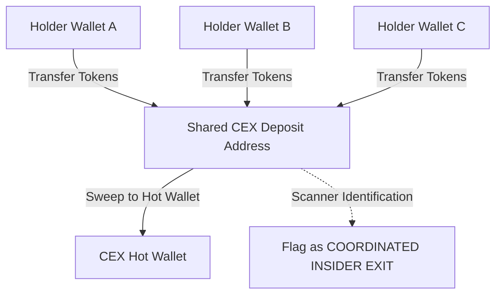
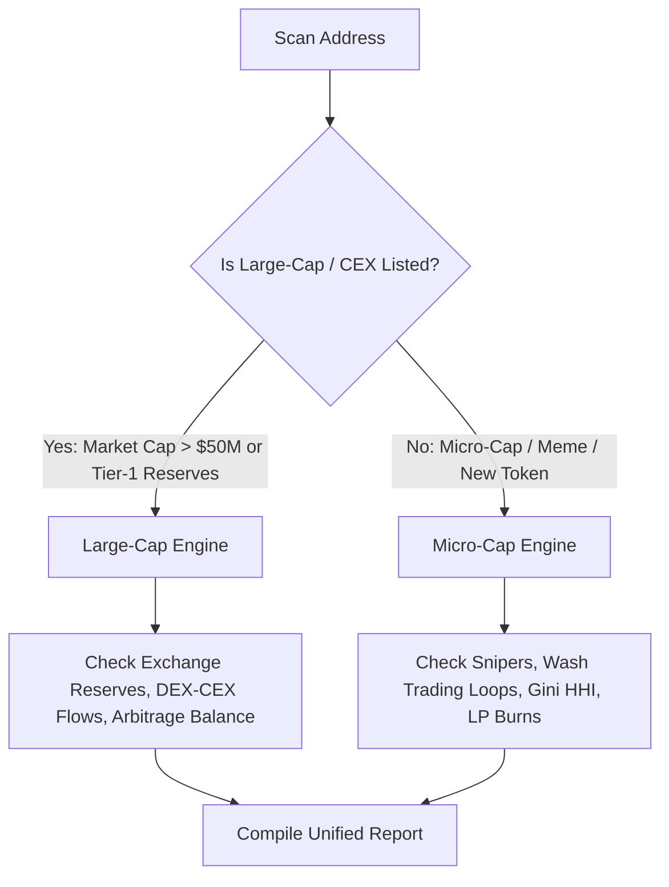

# Deep Scan Upgrade Specification: Transaction Scaling & Exchange Exit Tracking

This document outlines the architectural upgrades needed for the **Deep Scan** engine to handle larger statistical windows and track token flows involving Centralized Exchange (CEX) deposit accounts.

---

## 1. Current State vs. Proposed Upgrades

| Metric / Feature | Current Codebase | Proposed Upgrade |
|---|---|---|
| **Transaction Sample Cap** | Capped at 100 transactions (sliced in `DeepScanService.ts`). | Scale to **1,000–5,000 transactions** (or a 7-day time-bounded window) for statistical reliability. |
| **Whale/Buyer Profiling** | Looks at transaction patterns of top 5 buyers only. | Expands profiling to the top 50 buyers and snipers. |
| **Exchange Activity** | Identifies `toExchange` / `fromExchange` flags on transactions to filter out noise. | Explicitly traces **CEX Deposit Accounts** to detect coordinated dumps and off-chain exits. |
| **Gini / HHI Calculations** | Computed over a small transaction slice (100 txs). | Calculated over large-scale transaction pools to eliminate false concentration readings. |

---

## 2. Defining Transaction Windows for Deep Scans

To achieve high-fidelity intelligence, the scanner requires scaling input sizes based on block activity:

* **Basic Scans (2 credits)**: Keep cap at 100–200 transactions to minimize RPC costs and maintain sub-second response times.
* **Deep Scans (15 credits)**: Ingest **up to 10,000 transactions** from the node/API.
  * **Dynamic Scaling Logic**: 
    * If total transactions since creation (mint / block-0) are fewer than 10,000, dynamically fall back to fetching **100% of all available transactions**.
    * If the token is older and has high activity, fetch the latest 10,000 transactions.

---

## 3. The CEX Exit Heuristic (Tracking Coordinated Off-Chain Dumps)

A major gap in basic scanners is missing "off-chain selling." Instead of selling directly into the DEX liquidity pool, insiders often transfer tokens to multiple separate wallets, which then transfer them directly to a CEX (like Binance or Coinbase) to exit their positions without causing immediate on-chain price alerts.

### A. Coordinated CEX Deposit Detection
The upgraded engine will map transfers to CEXs:
1. **Detect CEX Deposit Wallets**: CEX deposit addresses are unique to users but share the same hot wallet cluster.
2. **Flag Sybil Deposits**: If 5 separate token holder addresses transfer their tokens to the *same* CEX deposit address, they are flagged as a single coordinated entity (insiders/sybils).
3. **P&L Impact**: Treat CEX transfers as "Implied Sales" at the current spot price, including them in whale dumping charts and profit-taking metrics.

### B. Funding Origin Auditing
* Trace the funding tx for top buyers: if 20 top buyer wallets were all funded by the same CEX hot wallet or bridge contract within the same 10-minute window, the engine flags a **Sybil Sniper Cluster** (market manipulation warning).

---

## 4. Dual-Engine Routing: Large-Cap vs. Micro-Cap Tokens

Running micro-cap metrics (like Gini concentrations, wash trading loop filters, sniper listings, and whale exit simulations) against established large-cap tokens (e.g. Uniswap, Chainlink, Pepe) listed on centralized exchanges will produce inaccurate "dangerous" security reports and damage the scanner's credibility.

We enforce a **Dual-Engine Router**:

### A. Large-Cap / CEX Listed Engine
* **Bypassed Checks**: Skips Sniper flags, HHI Volume Concentration warnings, Whale Exit Simulator price shock penalties, and wash trading loop notifications.
* **Focused Metrics**:
  * **Exchange Reserve Tracking**: Monitors balances on Binance, Coinbase, OKX, etc.
  * **DEX-to-CEX Arbitrage Flows**: Evaluates net inflows/outflows between CEX hot wallets and decentralized pools.
  * **Contract Verification**: Basic contract security validation.

### B. Micro-Cap / Meme / Launchpad Engine
* **Focused Metrics**: Runs the full suite of micro-intelligence: Whale Exit Simulation, Sniper detection, Wash Trading Loop extraction, Gini coefficient concentration, and Liquidity Locks.

