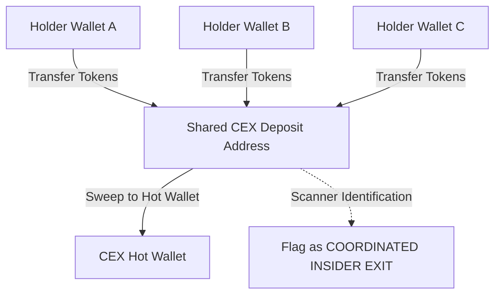
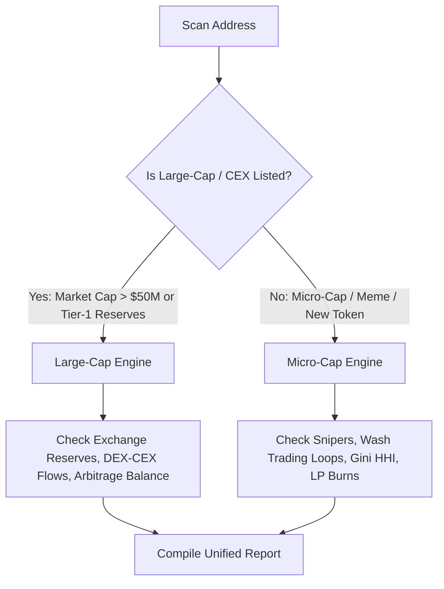

# Deep Scan Upgrade Specification: Transaction Scaling & Exchange Exit Tracking

This document outlines the architectural upgrades needed for the **Deep Scan** engine to handle larger statistical windows and track token flows involving Centralized Exchange (CEX) deposit accounts.

---

## 1. Current State vs. Proposed Upgrades

| Metric / Feature | Current Codebase | Proposed Upgrade |
|---|---|---|
| **Transaction Sample Cap** | Capped at 100 transactions (sliced in `DeepScanService.ts`). | Scale to **1,000–5,000 transactions** (or a 7-day time-bounded window) for statistical reliability. |
| **Whale/Buyer Profiling** | Looks at transaction patterns of top 5 buyers only. | Expands profiling to the top 50 buyers and snipers. |
| **Exchange Activity** | Identifies `toExchange` / `fromExchange` flags on transactions to filter out noise. | Explicitly traces **CEX Deposit Accounts** to detect coordinated dumps and off-chain exits. |
| **Gini / HHI Calculations** | Computed over a small transaction slice (100 txs). | Calculated over large-scale transaction pools to eliminate false concentration readings. |

---

## 2. Defining Transaction Windows for Deep Scans

To achieve high-fidelity intelligence, the scanner requires scaling input sizes based on block activity:

* **Basic Scans (2 credits)**: Keep cap at 100–200 transactions to minimize RPC costs and maintain sub-second response times.
* **Deep Scans (15 credits)**: Ingest **up to 10,000 transactions** from the node/API.
  * **Dynamic Scaling Logic**: 
    * If total transactions since creation (mint / block-0) are fewer than 10,000, dynamically fall back to fetching **100% of all available transactions**.
    * If the token is older and has high activity, fetch the latest 10,000 transactions.

---

## 3. The CEX Exit Heuristic (Tracking Coordinated Off-Chain Dumps)

A major gap in basic scanners is missing "off-chain selling." Instead of selling directly into the DEX liquidity pool, insiders often transfer tokens to multiple separate wallets, which then transfer them directly to a CEX (like Binance or Coinbase) to exit their positions without causing immediate on-chain price alerts.

### A. Coordinated CEX Deposit Detection
The upgraded engine will map transfers to CEXs:
1. **Detect CEX Deposit Wallets**: CEX deposit addresses are unique to users but share the same hot wallet cluster.
2. **Flag Sybil Deposits**: If 5 separate token holder addresses transfer their tokens to the *same* CEX deposit address, they are flagged as a single coordinated entity (insiders/sybils).
3. **P&L Impact**: Treat CEX transfers as "Implied Sales" at the current spot price, including them in whale dumping charts and profit-taking metrics.



### B. Funding Origin Auditing
* Trace the funding tx for top buyers: if 20 top buyer wallets were all funded by the same CEX hot wallet or bridge contract within the same 10-minute window, the engine flags a **Sybil Sniper Cluster** (market manipulation warning).

---

## 4. Dual-Engine Routing: Large-Cap vs. Micro-Cap Tokens

Running micro-cap metrics (like Gini concentrations, wash trading loop filters, sniper listings, and whale exit simulations) against established large-cap tokens (e.g. Uniswap, Chainlink, Pepe) listed on centralized exchanges will produce inaccurate "dangerous" security reports and damage the scanner's credibility.

We enforce a **Dual-Engine Router**:



### A. Large-Cap / CEX Listed Engine
* **Bypassed Checks**: Skips Sniper flags, HHI Volume Concentration warnings, Whale Exit Simulator price shock penalties, and wash trading loop notifications.
* **Focused Metrics**:
  * **Exchange Reserve Tracking**: Monitors balances on Binance, Coinbase, OKX, etc.
  * **DEX-to-CEX Arbitrage Flows**: Evaluates net inflows/outflows between CEX hot wallets and decentralized pools.
  * **Contract Verification**: Basic contract security validation.

### B. Micro-Cap / Meme / Launchpad Engine
* **Focused Metrics**: Runs the full suite of micro-intelligence: Whale Exit Simulation, Sniper detection, Wash Trading Loop extraction, Gini coefficient concentration, and Liquidity Locks.

### C. UI Presentation Rule: No Raw Transaction List
* **Backend Data Only**: The 10,000 fetched transactions are strictly processed server-side/in-memory to run statistical calculations.
* **UI Presentation**: The UI **never renders a raw transaction history list or table**. It only displays aggregated, sorted results and warning indicators (such as a list of the top 50 buyers, sniper flags, wash trading loops, or CEX exit sweeps). Rendering 10,000 rows would severely lag the user's browser and clutter the report.

---

## 5. Technical Feasibility, Cost & Implementation Details

### A. Feasibility of Fetching 10,000 Transactions
Fetching 10,000 transactions varies significantly by chain and API provider:

1. **EVM (Ethereum, BSC, Base, etc.)**:
   * **Mechanism**: Query BscScan/Etherscan API `/api?module=account&action=tokentx&address={token}&page=1&offset=10000&sort=desc`.
   * **Feasibility**: **Highly Feasible**. A single free API call returns up to 10,000 historical transfers instantly in JSON format.
   * **Cost**: $0 (Standard free-tier key, allows up to 5 requests per second).

2. **Solana**:
   * **Mechanism**: Direct RPC queries via standard Solana `getSignaturesForAddress` require pagination (100 signatures per page = 100 requests) followed by `getParsedTransactions` (10,000 calls), which is extremely slow and expensive.
   * **Primary Solution — Birdeye Token Trades API**:
     Query the **Birdeye Token Trades API**: `GET /defi/txs/token?address={address}&offset=0&limit=100` (paginated up to 10,000 using parallel batch fetching to optimize speed).
     * **Parallel Page Fetching**:
       ```typescript
       // Fetch 10,000 txns in 10 parallel batches of 10 pages each (100 txns/page)
       const BATCH_SIZE = 10;   // pages per parallel batch
       const PAGE_LIMIT = 100;  // txns per page
       const TARGET = 10000;
       const totalPages = TARGET / PAGE_LIMIT;  // 100 pages

       const allTx: any[] = [];
       for (let batch = 0; batch < totalPages / BATCH_SIZE; batch++) {
         const pagePromises = Array.from({ length: BATCH_SIZE }, (_, i) => {
           const offset = (batch * BATCH_SIZE + i) * PAGE_LIMIT;
           return fetchBirdeyePage(tokenAddress, offset, PAGE_LIMIT);
         });
         const results = await Promise.allSettled(pagePromises);
         results.forEach(r => r.status === 'fulfilled' && allTx.push(...r.value));
       }
       ```
     * **Feasibility**: **Highly Feasible**. Uses dedicated API key.
     * **Latency**: ~1,500ms total.
     * **Cost**: Birdeye API consumes credits. A 10,000-transaction sync costs roughly $0.02 - $0.05.
   * **Fallback Solution — Helius `getTransactionsForAddress`**:
     If Birdeye fails or rate limits, query Helius's custom RPC method `getTransactionsForAddress` which supports up to **1,000 parsed transactions per request** and uses cursor-based pagination.
     * **Pagination Logic**:
       ```typescript
       // Fetch 10,000 parsed transactions in 10 paginated requests (1,000 txns/request)
       const TARGET_LIMIT = 10000;
       const PAGE_LIMIT = 1000;
       const allTx: any[] = [];
       let paginationToken: string | undefined = undefined;

       for (let i = 0; i < TARGET_LIMIT / PAGE_LIMIT; i++) {
         const response = await helius.rpc.getTransactionsForAddress(tokenAddress, {
           limit: PAGE_LIMIT,
           before: paginationToken,
         });
         
         if (!response.transactions || response.transactions.length === 0) break;
         allTx.push(...response.transactions);
         
         if (!response.paginationToken) break;
         paginationToken = response.paginationToken;
       }
       ```
     * **Cost**: Metered at 110 credits per page of 1,000. Fetching 10,000 transactions costs 1,100 credits.

3. **Fallback Logic**:
   - If both Birdeye and Helius fail or rate limit, dynamically downgrade to standard RPC signatures-only history retrieval capped at 500 transactions.


### B. CEX Exit Heuristic Feasibility
- **CEX Wallet Directory**: We maintain a static map of known centralized exchange hot wallets and sweep addresses (compiled from public explorer labels).

  #### ✅ C-012 RESOLVED — CEX Hot Wallet List: Source & Maintenance

  **Problem was**: No data source or update cadence was specified for the CEX hot wallet list.

  **Initial Data Sources** (all free, public):
  | Source | Method |
  |---|---|
  | [Etherscan Public Labels](https://etherscan.io/labelcloud) | Download "Exchange" label list via Etherscan label API |
  | [Solscan Public Labels](https://solscan.io/accounts) | Filter accounts labeled "Exchange" from Solscan public explorer |
  | [Binance Hot Wallets (public)](https://etherscan.io/accounts/label/binance) | Directly enumerable from Etherscan label pages |
  | Community Arkham data | Cross-reference with Arkham Intelligence public entity pages |

  **Storage**: Stored as `lib/cex/data/cex_wallets.json` — versioned file in the repo.
  ```typescript
  interface CexWalletEntry {
    address: string;
    chain: 'eth' | 'bsc' | 'solana';
    exchange: string;        // e.g. "Binance"
    walletType: 'hot' | 'deposit_sweep' | 'cold';
    addedAt: string;         // ISO date
  }
  ```

  **Maintenance Cadence**:
  - **Monthly**: Developer manually adds newly discovered exchange wallet addresses from public explorer labels.
  - **Auto-detection**: If 10+ users report the same `to` address as an exchange exit within 30 days, it is flagged for admin review and potential addition to the registry.
  - **Acknowledged Limitation**: Fresh, unlabeled deposit addresses are missed until they sweep to the main hot wallet. This is explicitly noted in the scan result: *"CEX exit detection covers known exchange wallets only. Unlabeled deposit addresses may not be caught."*

- **Cluster Matching**: Run in-memory clustering on the transaction batch:
  ```typescript
  const cexDeposits = transactions.filter(tx => tx.toExchange === true);
  // Group by CEX deposit address
  const sybilGroups = groupBy(cexDeposits, 'to');
  ```
- **Feasibility**: **Highly Feasible**. In-memory processing of 10,000 transactions takes <10ms and has no external cost.
- **Limitation**: Only catches sweeps to known CEX addresses. Fresh, unlabeled deposit addresses will be missed until the exchange sweeps them to the main hot wallet (which occurs hours later).


