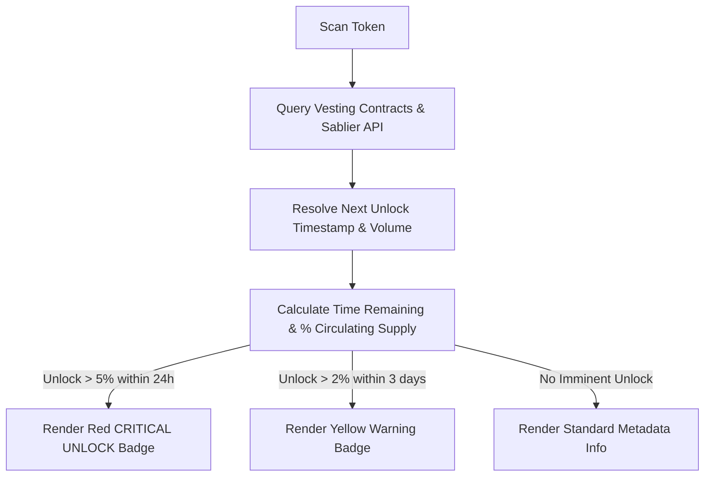

# Token Traceability: ICO, Airdrop, and Vesting Unlock Tracking

This document outlines the design requirements for tracking token launch origins (ICOs, presales, airdrops) and upcoming token unlock schedules to prevent false-positive "good" scans ahead of massive dumping events.

---

## 1. Traceability & Distribution Origins

When a token is scanned, the engine must audit its early supply distribution history to identify how the circulating tokens were first acquired:

* **ICO / Presale Detection**: Traces early transaction events (e.g. presale contract collections or bulk transfer events from the deployer wallet) to calculate what percentage of the total supply was sold to early investors.
* **Airdrop Distribution**: Analyzes if a token has distributed supply to a large array of wallets for free (e.g. high-volume multi-sender distributions in block-0 or early blocks).
  * *Risk*: High airdrop percentages (\(>10\%\) of supply) distributed to thousands of addresses indicate immediate sell-pressure once trading begins.

---

## 2. Token Unlock & Vesting Schedule Tracking

Even if current liquidity and holder metrics are excellent, a major upcoming unlock represents an imminent dump risk. We track token lock agreements and vesting smart contracts:

### A. Core Metrics to Extract
1. **Total Locked Supply**: Percentage of the total token supply currently locked in vesting contracts.
2. **Next Unlock Event**: The exact timestamp/countdown of the next scheduled token release.
3. **Next Unlock Volume**: Number of tokens and USD equivalent to be released.
4. **Vesting Allocation Split**: How much of the upcoming unlock belongs to Teams, Advisors, Private Investors, or Community.

### B. Supported Lockers & Protocols
* **Solana**: Streamflow, Solana Token Vesting program, Raydium lock authorities, custom multisig lock addresses.
* **EVM**: Sablier, Team Finance, PinkLock, Unicrypt, custom ERC20 Vesting/Lock contracts.

---

## 3. Unlock Risk Badges & Warning Thresholds

The scanning engine maps upcoming unlocks to dashboard warnings:

| Unlock Size (\% of Circulating Supply) | Time Until Unlock | Warning Badge | UI Visual Severity | Action |
|---|---|---|---|---|
| **Any** | \(> 7\) Days | `Vesting Active` | Blue (Info) | Display details in Vesting tab. |
| **\(> 2\%\)** | \(< 3\) Days | `⚠️ Emerging Unlock` | Yellow (Warning) | Alert on overview card. |
| **\(> 5\%\)** | \(< 24\) Hours | `🚨 CRITICAL UNLOCK RISK` | Red (Critical) | Prominent banner at the top of the scan terminal. |



---

## 4. Database Schema Extension

To avoid querying heavy vesting contract states on every single scan, we introduce a caching table:

```sql
CREATE TABLE token_unlock_schedules (
  id UUID PRIMARY KEY DEFAULT uuid_generate_v4(),
  token_address TEXT NOT NULL,
  chain TEXT NOT NULL,
  
  total_locked_percentage DECIMAL(5, 2) NOT NULL,
  next_unlock_at TIMESTAMP NOT NULL,
  next_unlock_percentage DECIMAL(5, 2) NOT NULL,
  next_unlock_usd_value DECIMAL(18, 2),
  
  vesting_details JSONB, -- Full schedule mapping (dates, volumes, recipients)
  last_updated_at TIMESTAMP DEFAULT NOW(),
  
  UNIQUE(token_address, chain)
);

CREATE INDEX idx_unlock_imminent ON token_unlock_schedules(next_unlock_at ASC) 
  WHERE next_unlock_at >= NOW();
```

---

## 5. Technical Feasibility, Cost & Implementation Details

### A. Airdrop / ICO Distribution Tracing
- **Mechanism**: Perform in-memory transaction audit on the transaction list:
  - If a single address (e.g. deployer or presale claim contract) transfers tokens to over 20 unique recipient wallets within a 5-minute block-0 window, the transaction is marked as a **distribution event**.
  - Sum the transfer amounts to find the total distributed percentage:
    $$\text{Airdrop \%} = \left( \frac{\sum \text{Airdropped Token Amounts}}{\text{Total Supply}} \right) \times 100$$
- **Feasibility**: **Highly Feasible**. Uses in-memory array filtering on the loaded transactions.
- **Cost**: $0 (0 external API queries).

### B. Vesting Lock Inquiries
- **EVM (PinkLock, Sablier, Team Finance)**:
  - **Mechanism**: Standard lockers maintain public contract addresses on-chain. We check if the token contract itself or locker registry contracts hold balances of the scanned token.
  - **Feasibility**: **Feasible**. For a robust implementation, we compile a static list of the top 5 locking contract addresses on each EVM chain (e.g. PinkLock, Unicrypt, Sablier) and run a batch `balanceOf` query.
  - **Cost**: $0 (Standard public RPC batch query).
- **Solana (Streamflow)**:
  - #### ✅ C-007 RESOLVED — Streamflow SDK vs Public API Clarification
  - **Problem was**: The spec implied Streamflow has a public free REST API — it does not.
  - **Correct Approach**: Streamflow is an **on-chain Solana program**. We query it by reading program accounts directly using the Solana RPC, not via a Streamflow API key.
  - **Implementation**:
    ```typescript
    // Streamflow program ID on Solana mainnet
    const STREAMFLOW_PROGRAM_ID = 'strmqZ7p4zPQzRqpgNMbW2s1zCdHPF1cMkBCAwJWyEr';

    // Find all vesting stream accounts for a given token mint
    const streamAccounts = await connection.getProgramAccounts(
      new PublicKey(STREAMFLOW_PROGRAM_ID),
      {
        filters: [
          { dataSize: 496 }, // Known stream account size
          { memcmp: { offset: 40, bytes: mintAddress } } // Filter by token mint
        ]
      }
    );
    // Parse each stream account's raw data to extract:
    // - start_time, end_time, amount_per_period, period, cliff_amount
    ```
  - **No API key required** — uses standard public RPC calls.
  - **Fallback**: If `getProgramAccounts` returns empty, the token has no Streamflow vesting. Check top holders via `connection.getTokenLargestAccounts()` — accounts owned by the Streamflow program will still appear there.
  - **Feasibility**: **Highly Feasible**.
  - **Cost**: $0 (Uses standard Helius / Solana RPC account queries).
- **Limitation**: Custom/unlisted vesting contracts will show up as "Top Holders" rather than flagged lockers. Gini coefficient analysis handles this by showing high holder concentration regardless of whether it is officially labeled as a lock.

