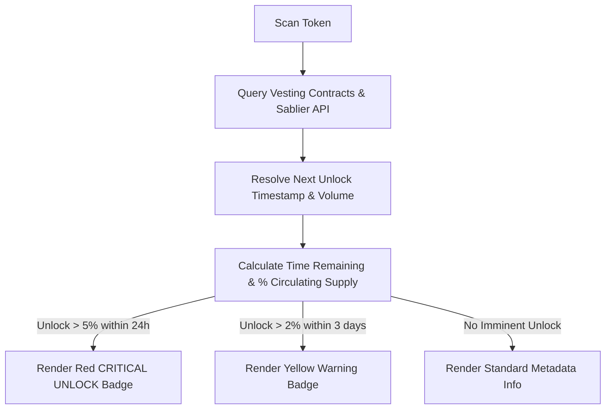

# Token Traceability: ICO, Airdrop, and Vesting Unlock Tracking

This document outlines the design requirements for tracking token launch origins (ICOs, presales, airdrops) and upcoming token unlock schedules to prevent false-positive "good" scans ahead of massive dumping events.

---

## 1. Traceability & Distribution Origins

When a token is scanned, the engine must audit its early supply distribution history to identify how the circulating tokens were first acquired:

* **ICO / Presale Detection**: Traces early transaction events (e.g. presale contract collections or bulk transfer events from the deployer wallet) to calculate what percentage of the total supply was sold to early investors.
* **Airdrop Distribution**: Analyzes if a token has distributed supply to a large array of wallets for free (e.g. high-volume multi-sender distributions in block-0 or early blocks).
  * *Risk*: High airdrop percentages (\(>10\%\) of supply) distributed to thousands of addresses indicate immediate sell-pressure once trading begins.

---

## 2. Token Unlock & Vesting Schedule Tracking

Even if current liquidity and holder metrics are excellent, a major upcoming unlock represents an imminent dump risk. We track token lock agreements and vesting smart contracts:

### A. Core Metrics to Extract
1. **Total Locked Supply**: Percentage of the total token supply currently locked in vesting contracts.
2. **Next Unlock Event**: The exact timestamp/countdown of the next scheduled token release.
3. **Next Unlock Volume**: Number of tokens and USD equivalent to be released.
4. **Vesting Allocation Split**: How much of the upcoming unlock belongs to Teams, Advisors, Private Investors, or Community.

### B. Supported Lockers & Protocols
* **Solana**: Streamflow, Solana Token Vesting program, Raydium lock authorities, custom multisig lock addresses.
* **EVM**: Sablier, Team Finance, PinkLock, Unicrypt, custom ERC20 Vesting/Lock contracts.

---

## 3. Unlock Risk Badges & Warning Thresholds

The scanning engine maps upcoming unlocks to dashboard warnings:

| Unlock Size (\% of Circulating Supply) | Time Until Unlock | Warning Badge | UI Visual Severity | Action |
|---|---|---|---|---|
| **Any** | \(> 7\) Days | `Vesting Active` | Blue (Info) | Display details in Vesting tab. |
| **\(> 2\%\)** | \(< 3\) Days | `⚠️ Emerging Unlock` | Yellow (Warning) | Alert on overview card. |
| **\(> 5\%\)** | \(< 24\) Hours | `🚨 CRITICAL UNLOCK RISK` | Red (Critical) | Prominent banner at the top of the scan terminal. |



---

## 4. Database Schema Extension

To avoid querying heavy vesting contract states on every single scan, we introduce a caching table:

```sql
CREATE TABLE token_unlock_schedules (
  id UUID PRIMARY KEY DEFAULT uuid_generate_v4(),
  token_address TEXT NOT NULL,
  chain TEXT NOT NULL,
  
  total_locked_percentage DECIMAL(5, 2) NOT NULL,
  next_unlock_at TIMESTAMP NOT NULL,
  next_unlock_percentage DECIMAL(5, 2) NOT NULL,
  next_unlock_usd_value DECIMAL(18, 2),
  
  vesting_details JSONB, -- Full schedule mapping (dates, volumes, recipients)
  last_updated_at TIMESTAMP DEFAULT NOW(),
  
  UNIQUE(token_address, chain)
);

CREATE INDEX idx_unlock_imminent ON token_unlock_schedules(next_unlock_at ASC) 
  WHERE next_unlock_at >= NOW();
```
